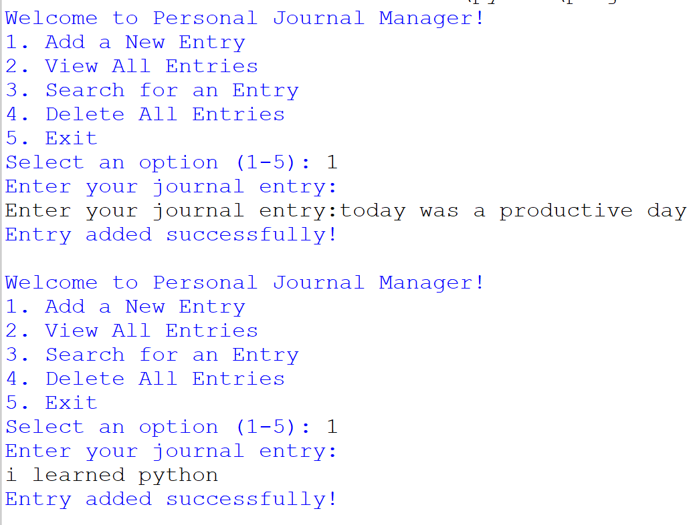
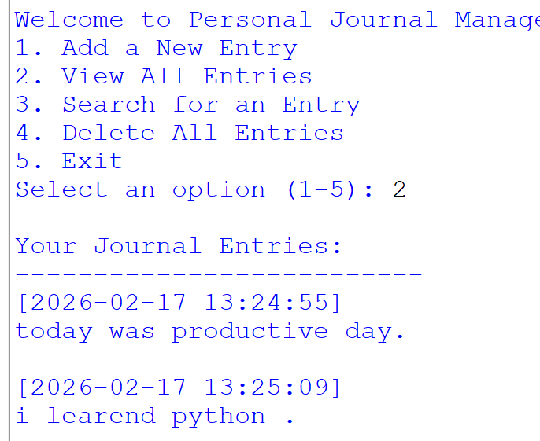
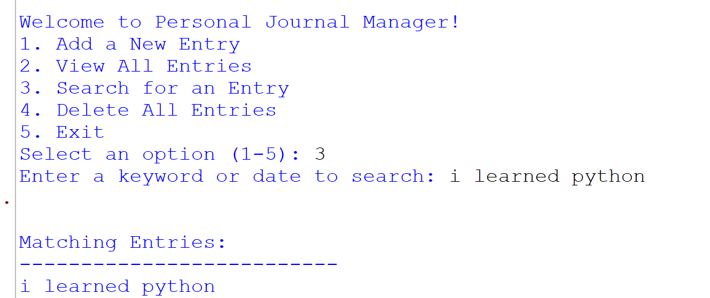
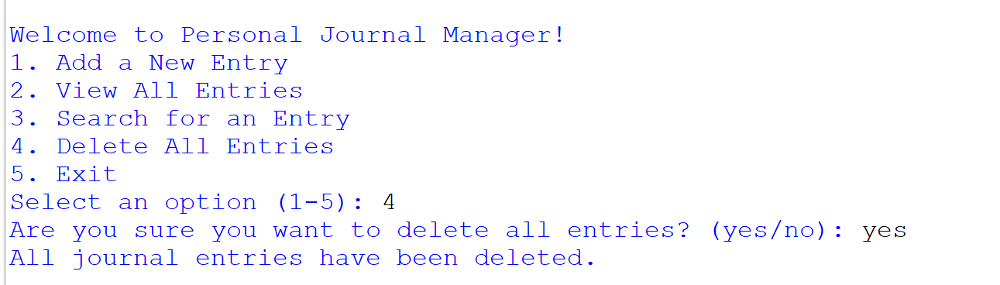
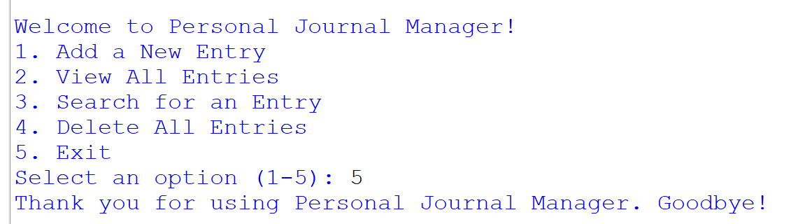

# 📔 Personal Journal Manager

A simple yet powerful **Python CLI-based Journal Application** 🐍  
This project helps you record your daily thoughts, search memories, and manage entries easily.

---

## 🌟 Key Features

✨ Add journal entries with date & time  
📖 View all saved entries in one place  
🔍 Search entries using keywords or dates  
🗑️ Delete all entries with confirmation  
⚡ Fast & beginner-friendly menu system  

---

## 🧰 Tech Stack

- Python 🐍  
- File Handling 📂  
- datetime module ⏰  
- CLI Interface 💻  

---

## 📁 Folder Structure

```
Personal-Journal-Manager/
│── p6.py
│── journal.txt
│── Screenshots/
│   ├── sc-1.png
│   ├── sc-2.png
│   ├── sc-3.png
│   ├── sc-4.png
│   ├── sc-5.png
```

---

## 🚀 Getting Started

### ▶️ Run the Project

```bash
python p6.py
```

---

## 📸 Application Preview

<<<<<<< HEAD
### 🟢 1. Add New Journal Entry
📌 Users can write and save their daily thoughts with timestamps.



---

### 📖 2. View All Entries
📌 Displays all stored journal entries in a clean format.



---

### 🔍 3. Search Journal Entry
📌 Quickly find entries using keywords or date.



---

### 🗑️ 4. Delete All Entries
📌 Deletes all entries after user confirmation.



---

### 📌 5. Extra Output / Menu Flow
📌 Shows additional working or menu interaction.


=======
## 🖊️ Adding Journal Entries


---

## 📖 Viewing All Entries


---

## 🔍 Searching Entries


---

## 🧹 Deleting All Entries


---

## 👋 Exiting the Program

>>>>>>> 1b019af1ff96bf16abc9a9ac251cd055524aef51

---

## ⚙️ How It Works

- All entries are stored in **journal.txt**
- Each entry includes:
  - 📅 Date  
  - ⏰ Time  
  - 📝 Content  

### 📌 Example Entry:
```
[2026-02-17 13:25:09]
I learned Python.
```

---

## 🧠 Concepts Used

📌 Functions  
📌 Loops  
📌 File Handling  
📌 Conditional Statements  
📌 String Searching  

---

## ⚠️ Important Note

❗ Once deleted, entries **cannot be recovered**  
✔ Always confirm before deleting  

---

## 💡 Future Enhancements

<<<<<<< HEAD
🚀 Add edit/update feature  
🔐 Add password protection  
🖥️ Build GUI version (Tkinter)  
📄 Export entries as PDF  

---

## 👨‍💻 Author

**Dhruv Prajapati**


"# project-six" 
>>>>>>> 1b019af1ff96bf16abc9a9ac251cd055524aef51
